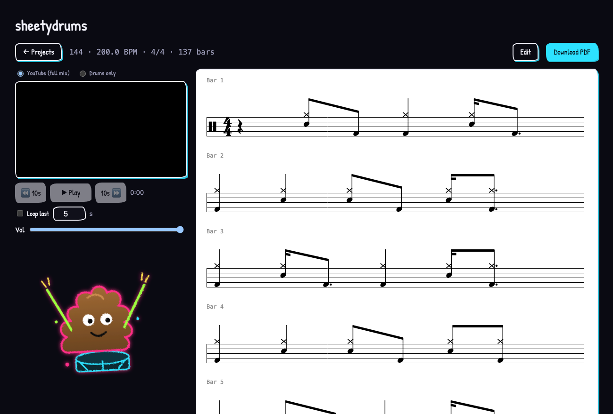

# sheetydrums 💩🥁

Paste a YouTube link, get an interactive drum chart you can play along to and correct by hand.

sheetydrums separates the drums out of a full song mix, transcribes and classifies the hits, tracks the beat, and renders a real percussion-staff score in the browser — synced to the video, with a moving playhead and a manual editor for fixing the transcriber's mistakes.



> **Non-commercial.** The pipeline uses non-commercially-licensed model weights — see [Licensing](#licensing--credits). Also: fetching audio from YouTube is against YouTube's Terms of Service. This is a hobby project; use it accordingly.

## What it does

- **Projects from a URL** — paste a YouTube link; the transcription is saved as a project you can reopen and keep editing.
- **Synced playback** — watch the video (or listen to the isolated **drums-only** stem) with a red playhead sweeping the active bar, which auto-scrolls to the top so you can read ahead.
- **Transport** — play/pause, ±10s, an adjustable "loop last N seconds," and volume — handy for working out a fill.
- **Manual editing** — toggle Edit for a fixed 16th-note grid: click to add hits, click a note to reclassify / nudge / delete, then Save. Unsaved changes prompt before you leave.
- **Readable notation** — beat-aware beaming, dotted values, and rests where they belong (VexFlow engraving).

## Pipeline

```
YouTube URL ─► yt-dlp ─► mix.wav
mix ─► Demucs v4 (drums stem) ─┬─► ADTOF ───────────► 5-class onsets ─┐
                              └─► DrumSep MDX23C ──► 6 drum sub-stems ┴─► CheukExpander ─► richer classes
mix ─► Beat This! ───────────► beats + downbeats ─► tempo + time signature
              all the above ─► quantize to a 16th grid ─► events.json ─► VexFlow web view
```

Model choices and the research behind them are in `docs/research/2026-05-pipeline-survey.md`; a plain-English intro to the audio-ML terms is in `docs/mir-primer.md`.

## Quick start

**Prerequisites:** [`uv`](https://docs.astral.sh/uv/) (Python), [`pnpm`](https://pnpm.io/) (Node), and `ffmpeg` on your PATH (`brew install ffmpeg`).

```sh
make install     # backend (uv) + frontend (pnpm) dependencies
make dev         # runs the API (:8000) and the web app (:5173) together
```

Then open **http://localhost:5173** and paste a YouTube URL. First run downloads model weights (~1 GB total, cached afterwards); on Apple Silicon the pipeline runs on MPS.

Other targets: `make backend`, `make frontend` (run one at a time), `make test` (backend tests). Run `make` for the list.

The CLI works standalone too:

```sh
cd backend
uv run sheetydrums "https://www.youtube.com/watch?v=…" -o events.json
uv run sheetydrums song.mp3 -o events.json --debug-dir /tmp/stages
```

## Layout

- `schema/` — JSON Schemas. `events.schema.json` is the contract between the two halves; `project.schema.json` wraps it with the YouTube source.
- `backend/` — Python (`uv`): separation, transcription, sub-stem separation, class expansion, beat tracking, quantization, plus a FastAPI server and an on-disk project store.
- `frontend/` — Vite + TypeScript + VexFlow web app: projects list, synced player, and the score renderer/editor.

Lock the schema and the two halves move independently. See `CLAUDE.md` for a deeper architecture tour.

## Development

```sh
cd backend && uv run pytest            # fast unit tests
cd backend && uv run pytest --run-slow # + end-to-end smoke test (real models, ~40s)
cd frontend && pnpm run typecheck
```

TypeScript types for the JSON contracts are generated from the schemas (`pnpm run schema:gen`).

## v1 scope

- **Input:** full song mixes (YouTube or a local file via the CLI).
- **Output:** interactive web view (no PDF/MusicXML export).
- **Drum vocab:** kick, snare, hi-hat (closed/open), ride, crash, toms (high/mid/low).
- **Out of scope for v1:** ghost notes, dynamics, swing/triplet detection. See `docs/v2-backlog.md`.

## Licensing & credits

The **source code** is MIT (see `LICENSE`). The project as a whole is **non-commercial**, because two of the pretrained model weights it downloads are CC-BY-NC-SA 4.0. Full attributions and license terms are in `NOTICE`. In short:

- **ADTOF** (transcription) and **DrumSep MDX23C** (jarredou/aufr33, sub-stems) — CC-BY-NC-SA 4.0 (NonCommercial).
- **Demucs v4** (Meta) and **Beat This!** — MIT. **VexFlow** — MIT. **yt-dlp** — public domain.
- The 5→richer-class expansion follows Cheuk et al., arXiv:2509.24853.

Don't use it commercially, and attribute the above if you build on it.
